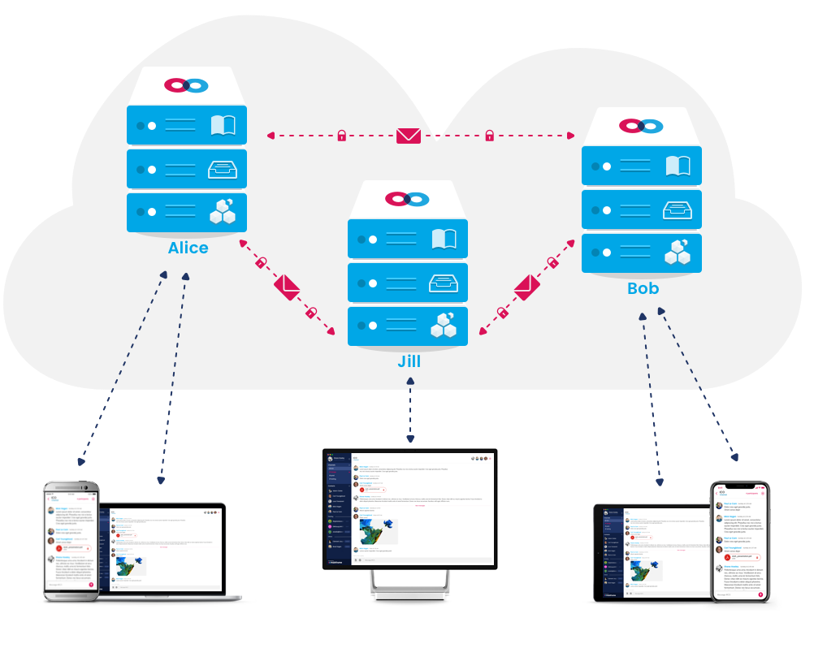

# onyx

Decentralized messaging application based on PSS.

## Introduction

Onyx is a proof-of-concept for our next phase of development on a fully-decentralized messaging platform. It relies on a secure messaging protocol in the Ethereum core called [PSS](https://github.com/ethersphere/go-ethereum/tree/pss/swarm/pss).

## Installing

To install Onyx, download and install the latest release binaries for your platform from our [releases page](https://github.com/thusfresh/onyx/releases). If you wish to install the mailboxing service remotely, follow the instructions on its [README](https://github.com/MainframeHQ/onyx-server).

## Know issues

This application is only a proof of concept. It is meant for demonstration purposes. As such, there is no guarantee of:

- **Security**: Our codebase is not fully tested. We authenticate both the client app and the Mainframe mailboxing service and use TLS between the two, but any intruder who succeeded in accessing a remotely-installed service could read your messages, as they are stored in plaintext. Messages are transmitted via [PSS](https://github.com/ethersphere/go-ethereum/tree/pss/swarm/pss), which is intended to be highly secure but is still beta software.
- **Reliability**: PSS does not provide deliverability guarantees. When remotely installed, however, the [onyx-server](https://github.com/MainframeHQ/onyx-server) is designed to store messages sent to you while you are offline. As long as PSS delivers them successfully to your Mainframe mailboxing service, they should be waiting for you when you open your desktop or mobile app again. If you are running in the default mode, which runs the mailbox service only locally, any messages sent to you while your app is not running will be lost.
- **Performance**: We have not sufficiently tested this PoC for large-scale use. All messages are stored in a global state file that gets updated with each new message that is received. We anticipate that this will not scale well. The message store was created quickly for the PoC, and will require a more robust implementation in our next phase of development.

## Get in touch!

Although this release is not officially supported, we really want to hear your feedback. If you become aware of a bug or have a great idea about a feature that would make Mainframe more awesome, please submit an issue on our [issues page](https://github.com/thusfresh/onyx/issues).

We would also love to chat with you on the Mainframe PoC! To converse with us there, add any member of the Mainframe team as a contact and we will invite you to a general feedback channel:

* Adam Clarke: pubkey
* Austin Craig: pubkey
* Brad Hagen: pubkey
* Carl Youngblood: pubkey
* Clement Jaquier: pubkey
* Diogo Perillo: pubkey
* Jacek Królikowski: pubkey
* Luca Tavazzani: pubkey
* Mick Hagen: pubkey
* Miloš Mošić: pubkey
* Shane Howley: pubkey

## Architecture

Mainframe is a compromise-free messaging platform that combines the desired features of today's best messaging tools while also maintaining the highest level of security and user sovereignty. The platform consists of user-installed client apps (mobile and desktop) that connect to a Mainframe node. This node can be run on the user's desktop or deployed to the cloud.

A Mainframe node consists of a blockchain node with a messaging layer and various services necessary for storing messages and managing contacts. The first supported blockchain is [Ethereum](https://www.ethereum.org) and makes use of the [Swarm](https://github.com/ethersphere/swarm) distributed storage platform and [PSS](https://github.com/ethersphere/go-ethereum/tree/pss/swarm/pss) secure messaging protocol for message delivery and file storage. Later development milestones will include support for messaging on and between multiple blockchains, and incentivization for reliable message delivery and file storage using Mainframe tokens.

PSS is a connectionless communication protocol that provides dark routing capabilities in addition to conventional cryptography. A configurable level of per-message routing information allows senders to choose how specific they wish to be about whom their message is addressed to. By omitting or partially omitting the recipient’s address, messages are delivered to all matching addresses, thus increasing the difficulty of identifying both sender and receiver amidst numerous duplicate messages, or of targeting specific nodes for attack or disruption. These features enable extremely secure communications. Given networks of sufficient size, dark routing makes it virtually impossible to detect messaging activity between specific nodes. The only reliable means of disrupting this communication is to disable general Internet access, a measure which most jurisdictions are understandably reluctant to take.

## Development

You need a running Swarm node serving a WebSocket server on `localhost:8546` for PSS and a HTTP server on `localhost:8500`.  
These values can be changed using the environment variables `SWARM_WS_URL` and `SWARM_HTTP_URL`.

After you pull this repository, run `yarn` to install all the dependencies.

Run `yarn start` to start the development server for the frontend. It will serve it on `localhost:3000`.  
Once ready, you can run `yarn electron` to start the electron app, connecting to Swarm and creating a GraphQL server for the frontend.

### Project structure

- `app`: electron app
- `assets`: build assets (app icons)
- `dist`: app builds
- `public`: assets that will be added to the `build` folder
- `src`: source code

## Contributing

Thanks for your interest in our project! Feel free to examine our list of potential enhancements on our [issues page](https://github.com/thusfresh/onyx/issues) and help us implement them. Feel free to submit an feature request or bug report yourself as well.

## License

[MIT](LICENSE)
